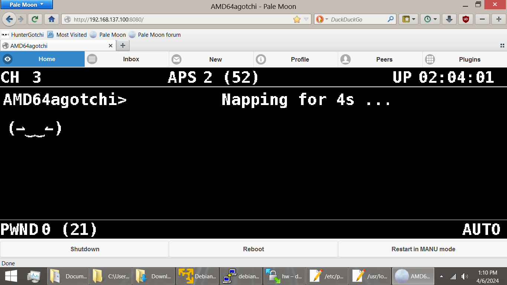

# Pwnagotchi-Netbook
Pwnagotchi on your laptop or netbook!

I wanted an excuse to revive some old hardware so this is what I came up with.
It is Pwnagotchi running on a Debian 11 VM. VMware Workstation Player is the format used.
Now you can drag out your old school wardiving gear! Put that $100 patch antenna to work
and eat all the wifi!
My hardware is an old Acer Windoze 8.1 netbook with dual cores.
The extracted VM folder is approx 11GB.
Suprisingly did not have too many package compiles or funny business to get everything working.
I did 'apt-mark hold  libpcap8.0 libpcap8.0-dev' because I had to use a weird version to get hcxtools installed
I think.
The login is debian and pass debian. The root pass is toor. AI took less than 2 mins to startup.

I set the VM to use the hosted network adapter instead of NAT.

After starting VM and logging in, then plugin your wireless adapter.

To adjust Pwnagotchi screen size edit '/usr/local/lib/python3.11/dist-packages/pwnagotchi/ui/hw/inky.py'
self._layout['width']
self._layout['height']
Then adjust layout with the Tweak-view plugin.
The screenshot shows my layout on a 1366x768 resolution screen. To get more real estate you could find a way to have browser full screen
or hide parts of your browser. Remember to make things bigger, reduce the resolution values.

** I changed the driver in '/usr/bin/pwnlib' to use a TL-WN722N. Use search and replace to find ath9k_htc and use your required driver as there
are a few references. I didn't use modprobe 
but might work for you. This VM works if your pwning wireless adapter is wlan0. **

Caveats:
For the life of me I could not get any plugins that read sensors to read them from the host. If you are (likely) smarter than
me and can figure it out please let me know in the issues tab. I also removed 'temperature' references from a few other files in
'/usr/local/lib/python3.11/dist-packages/pwnagotchi'.

Thoroughly check the config.toml to see what I changed from default and change accordingly.

Had a weird issue with bettercap and had to edit '/etc/default/crda' to only use channels 1 - 11. Prob related just to my
adapter but dunno.

*** Update ***
Added a program that is NOT installed in the VM called 'pwnagotchi-start' that you can use after you're up and running that will
start the necessary services for pwnagotchi pwning if so desired. The idea for the use case is if you use other programs like 
Wifite or AngryOxide regularly you don't want pwwnagotchi services starting automatically. Requires using beforehand:

sudo systemctl disable pwnagotchi.service

sudo systemctl disable bettercap.service

sudo systemctl disable pwngrid-peer.service

https://drive.google.com/drive/folders/1wtYtoiIxTfJI77TdaoXaarOLjOBIc8RW?usp=sharing

Credits:
https://sourceforge.net/projects/linuxvmimages/files/VMware/D/

https://github.com/jayofelony/pwnagotchi-bullseye
